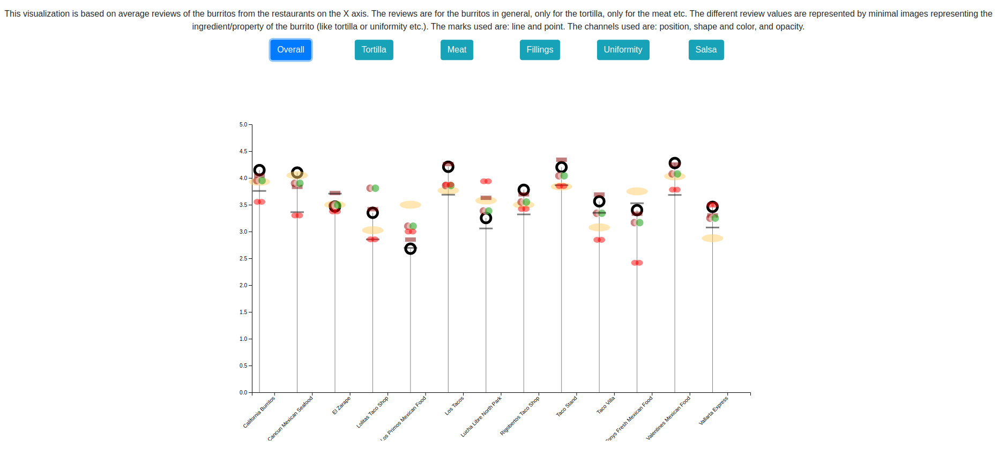

# Burrito Visualization

In this homework, you will create a unique visualization that goes beyond the "common chart types" that you already exist. **This assignment is worth 10 points.**

The audience for this visualization is visitors to a musuem. The goal is to communicate certain aspects of the data effectively and in a creative manner, as opposed to supporting in-depth analysis such as might be done by domain experts.

## Dataset 

[Data source](https://www.kaggle.com/srcole/burritos-in-san-diego)): This dataset contains a single table that lists several ratings of >400 burritos from >50 restaurants in San Diego.

The data is processing into a simple aggregation for several ingredients in a burrito by using the Pandas library in a Jupyter notebook.

## Design

The visualization uses minimal icons/representations of burrito ingridients to show the user which particular ratings is being viewed.

The design of the chart is loosley inspired by: 
    * [How's life?](http://www.oecdbetterlifeindex.org/#/31111111111)

## Screenshot

